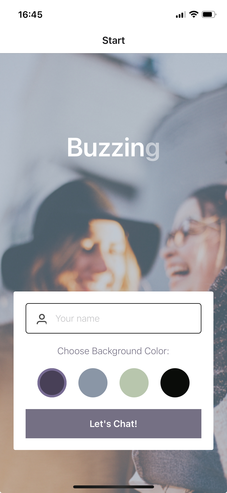
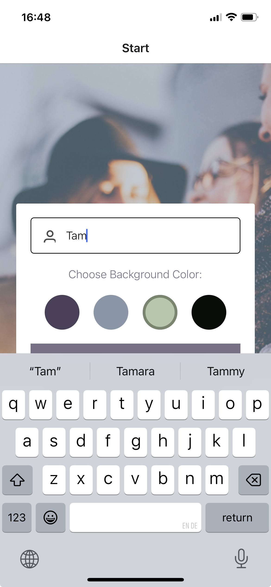
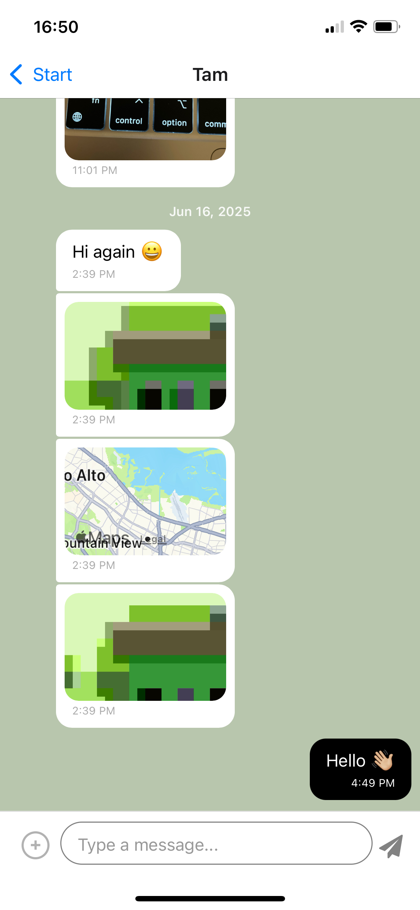
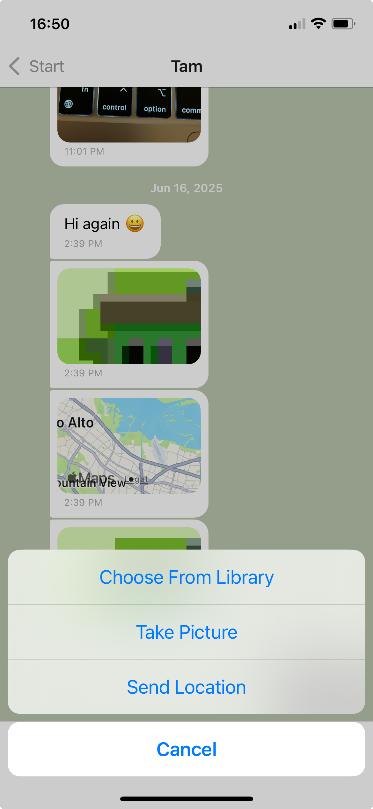

# 💬 **Buzzing - Chat App**

**Buzzing** is a simple and user-friendly chat application that allows users to easily connect with friends, family, and others. Users can share messages, images, and their location, and personalize their chat experience by choosing one of four given background colors.


## Content

1. [Tech Stack](#tech-stack)
2. [Features](#features)
3. [Setup & Installation](#setup--installation)
4. [Screenshots](#screenshots)

## Tech Stack

- **React Native**: the app is written in React Native.
- **Expo**: the app is developed using Expo. 
- **Google Firestore Database**: chat conversations are stored in Google Firestore Database, and users will be anonymously authenticated also via Google Firestore Database.
- **Local Storage**: chat conversations are also stored locally.
- **Firebase Cloud Storage**: images are stored in Firebase Cloud Storage.
- **Gifted Chat**: the chat interface and functionality are created using the Gifted Chat library.

---

## Features

- **Start Component**: users are able to enter their username and choose one of the four given background colors for the chat screen before joining the chat.
- **Chat Component**: displaying the conversation, as well as an input field and submit button.
- **Image sharing**: users are able to send images by selecting them from their image library or by taking them with their camera.
- **Location sharing**: users are able to send location data.
- Data gets stored **online** and **offline**.
- **Users with a visual impairment**: are also able to use app thanks to a screen reader.

---

## Setup & Installation

### 1. Prerequisites

- **Node.js** - required v18 or v20
- **Expo CLI**
- **Git**
- **Expo Go** app on your smartphone or iOS Simulator (**XCode**) or Android Emulator (**Android Studio**)

### 2. Installation

Follow these steps to get started with **Buzzing**:
- Clone the repository:
```
git clone https://github.com/tamperic/Buzzing-Chat-App.git
cd Buzzing-Chat-App
```
- Install dependencies:
```
npm install 
or
yarn install
```
-  Start the development server - navigate to the project folder in terminal and run locally:
```
npx expo start
```
- You can then scan the QR code with the Expo Go app on your mobile device, or run the app on an emulator (type **a** in terminal to open Android, **i** to open iOS, or **w** in a web browser)

## Screenshots & How To Use?

1. Open the app 

    

2. Enter your username and choose one of the four given background colors to personalize your chat experience

    

3. Press "**Let's chat!**" button to join the chat

4. Type something into the input field and press the send icon

    

5. You can also share your location, take a picture with your device's camera or select an images from your photo library

    